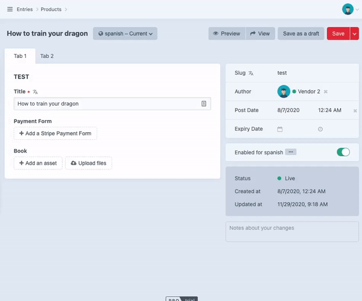

   

	

# Presence Plugin for Craft CMS

Display current users editing an entry. The users will be displayed in the right sidebar settings when editing an entry. If the user does not have a profile image, a default logo with the first letter of the name will be displayed.

## Roadmap

- Approved / Reviewed button
- Setting to adjust background color for users with no pictures.

------------------------------------------------------------

Brought to you by [enupal](https://enupal.com/en)

	

